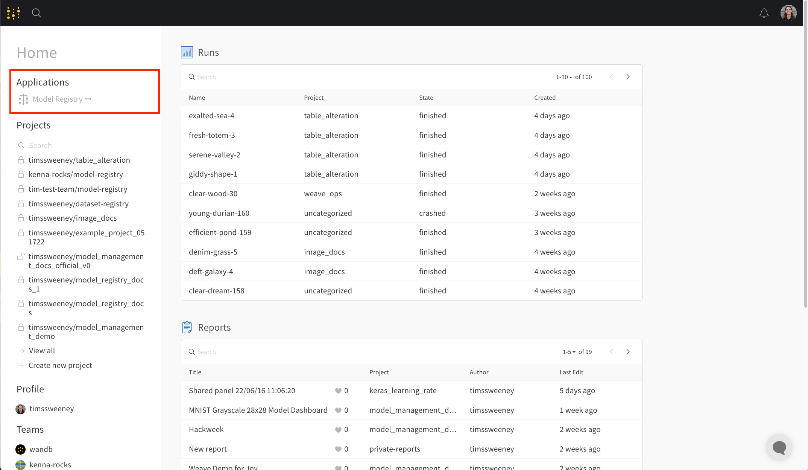

# Model Registry
Catalog and version models, track metadata and lineage, promote the best models to production, and report on evaluation analytics.

In this walkthrough you'll learn how to use Weights & Biases for Model Management. Track, visualize, and report on the complete production model workflow.

1. Model Versioning: Save and restore every version of your model & learned parameters - organize versions by use case and objective. Track training metrics, assign custom metadata, and document rich markdown descriptions of your models.
2. Model Lineage: Track the exact code, hyperparameters, & training dataset used to produce the model. Enable model reproducibility.
3. Model Lifecycle: Promote promising models to positions like "staging" or "production" - allowing downstream users to fetch the best model automatically. Communicate progress collaboratively in Reports.

## Before you get started
Before you get started, make sure you have satisified the following prerequisites:

## Create a new Model Collection
First, create a Model Collection to hold all the candidate models for your particular modeling task. In this tutorial, we will use the classic `MNIST Dataset - 28x28` grayscale input images with output classes from 0-9. The video below demonstrates how to create a new **Collection:1**. 

Model Registry
1. Visit your Model Registry at wandb.ai/registry/model (linked from homepage).

2. Click the Create Model Collection button at the top of the Model Registry.
3. Select Type: model, Style: Collection, and enter a name. In our case `MNIST Grayscale 28x28`. Remember, a Collection should map to a modeling task - enter a unique name that describes the use case.

Artifact Browser
1. Visit your Project's Artifact Browser: wandb.ai
2. Click the + icon on the bottom of the Artifact Browser Sidebar
3. Select Type: model, Style: Collection, and enter a name. In our case `MNIST Grayscale 28x28`. Remember, a Collection should map to a modeling task - enter a unique name that describes the use case.

## Train and log model versions
Next, you will log a model from your training script:

1. (Optional) Declare your dataset as a dependency so that it is tracked for reproducibility and audibility
2. Serialize your model to disk periodically (and/or at the end of training) using the serialization process provided by your modeling library (eg PyTorch & Keras).
3. Add your model files to an Artifact of type "model"
    * We use the name `f'mnist-nn-{wandb.run.id}'`. While not required, it is advisable to name-space your "draft" Artifacts with the Run id in order to stay organized
4. Log your model
    * If you are logging multiple versions, it is advisable to add an alias of "best" to your Model Version when it outperforms the prior versions. This will make it easy to find the model with peak performance - especially when the tail end of training may overfit!
5. (Optional) Log training metrics associated with the performance of your model during training.